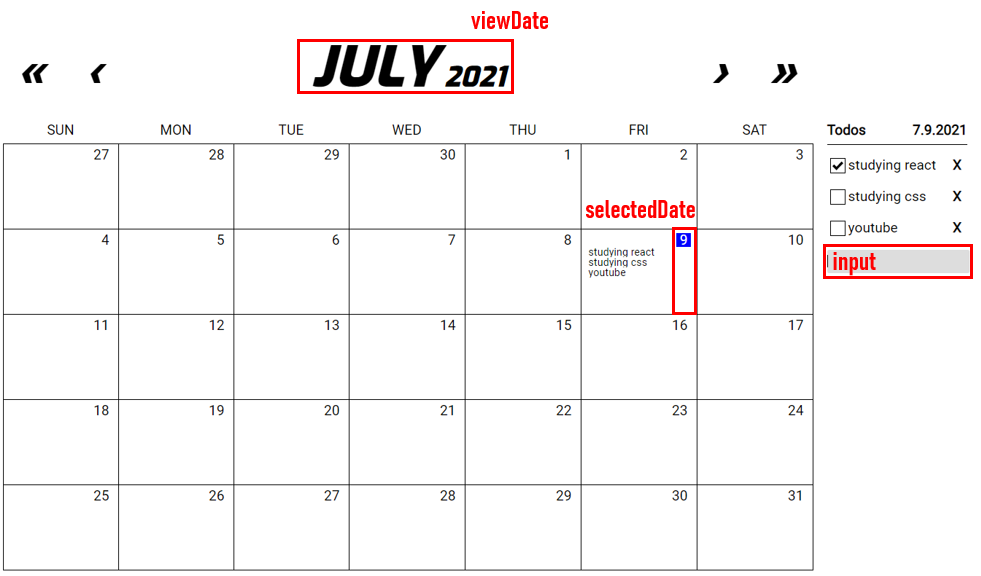

# Calendar with Todo

### Libraries
- react
- redux
- react-redux
- immutable

### Project Structure
```
└─ Github
      │  README.md
      └── src
           ├── components
           │    ├── navigation
           │    ├── month-view
           │    ├── todo-list-template
           │    ├── Calendar.js
           │    └── App.js
           │
           ├── containers
           │    └── CalendarContainer.js
           ├── store
           │    ├── modules
           │    │    └── Calendar.js
           │    ├── configure.js
           │    └── index.js
           └── styles
```

#### 1. State
```js
// src/store/modules/Calendar.js
const initialState = Map({
    input: '',
    viewDate: dateToNum(new Date()),
    selectedDate: dateToNum(new Date()),
    todos: List(),
});
```

